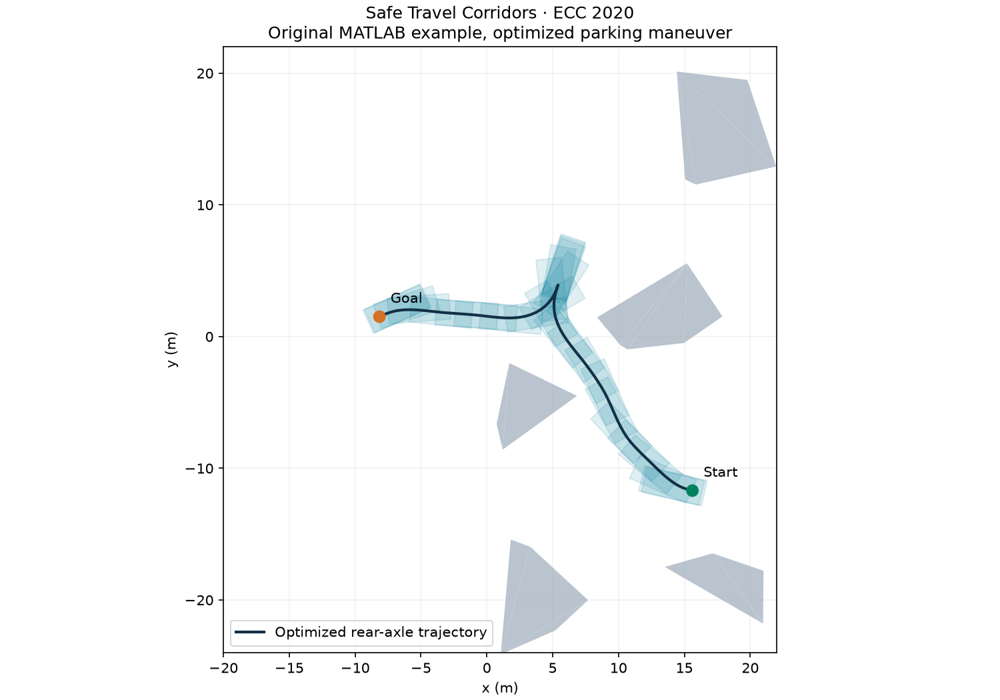
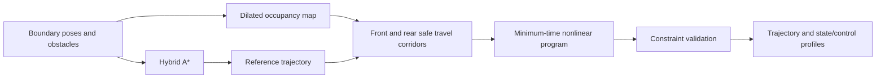

# Automatic Parking with Safe Travel Corridors

**From a hybrid A* path to a dynamically feasible, minimum-time parking maneuver.** This repository accompanies the ECC 2020 paper *Maneuver Planning for Automatic Parking with Safe Travel Corridors: A Numerical Optimal Control Approach*. It includes the original MATLAB/AMPL formulation and a standalone C++/CasADi implementation of its two-disc corridor optimization.



This figure comes from an actual solve of `Case1.mat`. Translucent rectangles show the vehicle body; the dark curve follows the rear-axle center.

## Method

Two circles cover the vehicle body. Obstacle-free rectangles are expanded around the circle centers along an initial path. The optimizer keeps each center inside its own corridor, replacing numerous vehicle–obstacle constraints with simple position bounds.



The example uses 100 configuration points, a 2.8 m wheelbase, speed bounds ±2.5 m/s, acceleration bounds ±1 m/s², steering bounds ±0.7 rad, and steering-rate bounds ±0.5 rad/s. The transcription follows the original `NLP.mod`: backward Euler with `h = tf / Nfe`. Thus the last stored sample has timestamp `(Nfe-1)*tf/Nfe`; the reported objective is `tf`.

## MATLAB: one-click example

Use **Windows MATLAB**, **Image Processing Toolbox** for map dilation, and a toolbox installation providing `robotics.ReedsSheppConnection` for the search. The verified environment is MATLAB R2021b. AMPL and an AMPL-compatible IPOPT are local command-line executables; no MATLAB-to-AMPL API is required.

Download the repository with its executables and DLLs intact. Open `RunMe.m` and click **Run**, or execute:

```matlab
addpath('C:/path/to/Automatic_Parking_Maneuver_Planning_ECC20');
result = RunMe();
```

The entry point resolves its own directory and creates **two static figures**:

1. Hybrid A*/optimized trajectory comparison and vehicle footprints.
2. Optimized states and controls.

Numerical results, AMPL inputs/outputs, and `solver.log` go into `results/`. Dynamics, endpoints, mechanical bounds, and corridor membership are checked before drawing the result. A failed solve raises an error instead of displaying an old trajectory.

AMPL/IPOPT must support this problem size under their own licenses. To use another installation, place its executable and matching runtime libraries together. The entry point explicitly selects the local `ampl.exe`.

## Files and responsibilities

| File | Function |
| --- | --- |
| `RunMe.m` | Run the complete example, validate it, and draw two figures. |
| `Case1.mat` | Original scene and endpoint poses. |
| `InitParams.m` | Vehicle, mechanical limits, search and discretization parameters. |
| `CreateDilatedCostmap.m` | Rasterize and dilate obstacles for the two-circle representation. |
| `SearchHybridAStarPath.m` | Geometric search with Reeds–Shepp connections. |
| `ResamplePath.p` | Protected resampling and initial state/control profiles. |
| `SpecifyLocalBoxes.m` | Expand each center's rectangle in 0.03 m increments, up to 10 m per side. |
| `WriteInitialGuess.m`, `WriteBoundaryValues.m` | Write full-precision numerical inputs. |
| `NLP.mod` | Minimum-time bicycle-model problem with two-disc corridor constraints. |
| `rr.run`, `ipopt.opt` | Solver invocation, settings, and fresh status/output files. |
| `ValidateParkingResult.m` | Independently check the returned trajectory's constraints. |
| `PlotParkingResult.m` | Static trajectory/footprint and state/control figures. |
| `C++/src/main.cpp` | Standalone search, corridor construction, CasADi optimization, and CSV export. |

Legacy visualization helpers remain in the repository; the current entry point uses `PlotParkingResult`.

## C++: dependencies, build, and run

Install **C++17**, **CMake ≥3.16**, and **CasADi with C++ headers/libraries and the IPOPT plugin**. See the [official installation instructions](https://github.com/casadi/casadi/wiki/InstallationInstructions) and [CasADi documentation](https://web.casadi.org/docs/). MATLAB and AMPL are not used by the C++ program.

```bash
cmake -S "C++" -B build -DCMAKE_BUILD_TYPE=Release -Dcasadi_DIR=/path/to/casadi/cmake
cmake --build build --config Release
./build/parking_demo --output results_cpp
```

For Windows with MinGW-w64 and a compatible CasADi distribution:

```powershell
$env:PATH = "C:\path\to\casadi;C:\path\to\mingw64\bin;" + $env:PATH
cmake -S "C++" -B build -G "MinGW Makefiles" -Dcasadi_DIR=C:/path/to/casadi/cmake
cmake --build build
.\build\parking_demo.exe --output results_cpp
```

The CasADi library directory must be on `PATH` (Windows) or `LD_LIBRARY_PATH` (Linux). The protected search DLL is copied beside the Windows executable automatically. The supplied search libraries target x86-64. Windows/MinGW execution is verified; the Linux library is cross-compiled and has not been runtime-tested here.

**MUMPS** is the default linear solver. An independently installed HSL library is optional: set `HSL_LIBRARY` and pass `--linear-solver ma27`.

The program writes:

- `trajectory.csv`: `t,x,y,theta,v,a,phi,omega`.
- `reference.csv`: the newly searched geometric reference.

Every run solves the problem. The files in `C++/data/` contain scene geometry and its dilated occupancy map, not a saved solution. The C++ initializer uses sampled hybrid A* primitives; its route and local optimum may differ from MATLAB's Reeds–Shepp-assisted initialization. Kinematics, bounds, disc offsets, corridor expansion, objective, and transcription follow the original formulation.

The included case was solved and checked in both implementations. This is a runnable example, not the paper's entire benchmark campaign.

## Citation

Please cite:

```bibtex
@inproceedings{Li2020SafeTravelCorridors,
  author = {Bai Li and Tankut Acarman and Xiaoyan Peng and Youmin Zhang
            and Xuepeng Bian and Qi Kong},
  title = {Maneuver Planning for Automatic Parking with Safe Travel Corridors:
           A Numerical Optimal Control Approach},
  booktitle = {2020 European Control Conference (ECC)},
  pages = {1993--1998},
  year = {2020},
  doi = {10.23919/ECC51009.2020.9143786}
}
```

Related foundation: B. Li and Z. Shao, “A unified motion planning method for parking an autonomous vehicle in the presence of irregularly placed obstacles,” *Knowledge-Based Systems*, 86, 11–20, 2015.

## License

See [LICENSE](LICENSE). AMPL, IPOPT, HSL, CasADi, and compiler runtime components retain their respective licenses.
